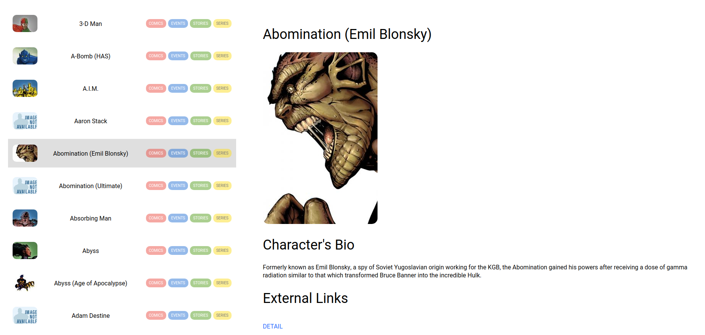

## Marvel's Characters

This app is a demo that fetches Characters information from Marvel's API, displays a list and then you can select those heroes and see some detail information about them!



## Installation

Please follow these instructions:

```bash
# Locate where you wanna place the repo and clone it
$ git clone https://github.com/hernanfarruggia/marvel-characters.git

# Once it finisshes, open the floder
$ cd marvel-characters

# Install dependencies
$ npm install

# Once finished, run the app!
$ npm start
```

And that's it!

## Details

This project was created with ReactJS by using `create-react-app`, so once you run it as mentioned above, you will have a virtual server running in watch mode, and you can play around with the code and see the changes in real time!

Inside `configs.js` you can set yout Public and Private API Key's to fetch data from the API. (See Troubleshooting section bellow)

## Troubleshooting

There's some issues with the Marvel's API when trying to fetch data, it throws an Authentication error saying the ApiKey or Hash is wrong. I've doing some research and seems to be a common issue, since a lot of people came with this same question in several forums. I also tried other implementations with no luck.
This means the app right now runs with a set of mocked data available in the API documentation. Should be the same as the API results, so won't affect the code, but is good to mention.
But in case you want to give it a try, just uncomment the code in the `actions.js` file and comment out the current `getCharactersList` function and don't forget to update your key's in the `configs.js` file! (For security reasons I won't post my private key! You need your own!) 